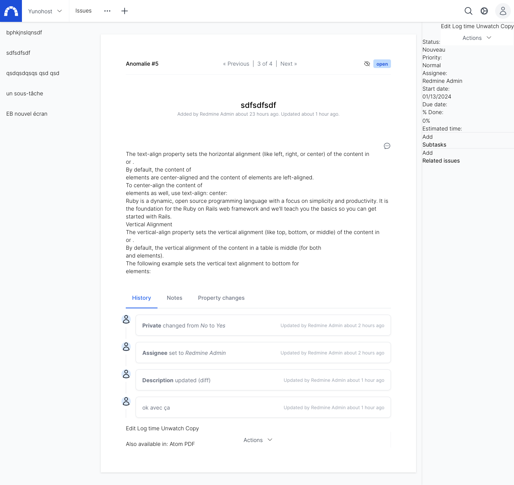
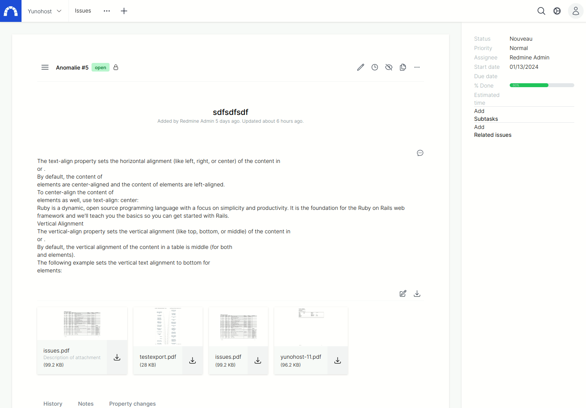
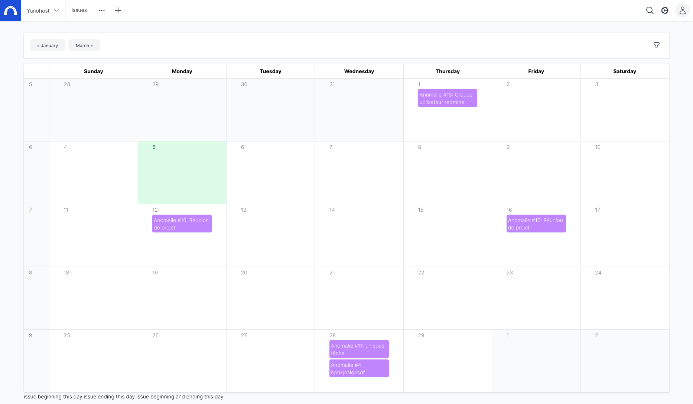
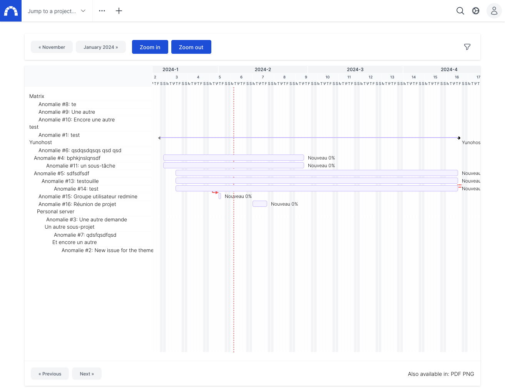
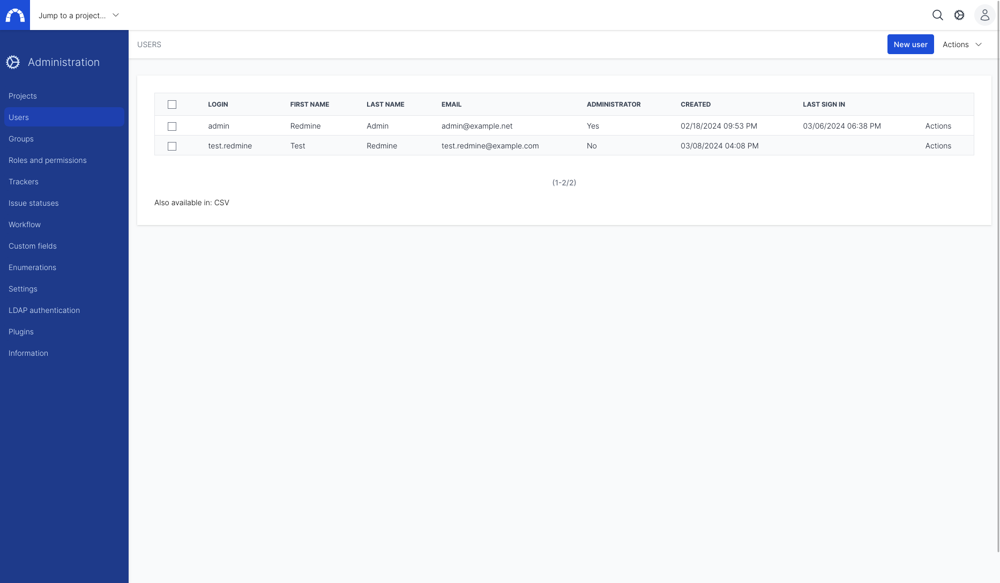
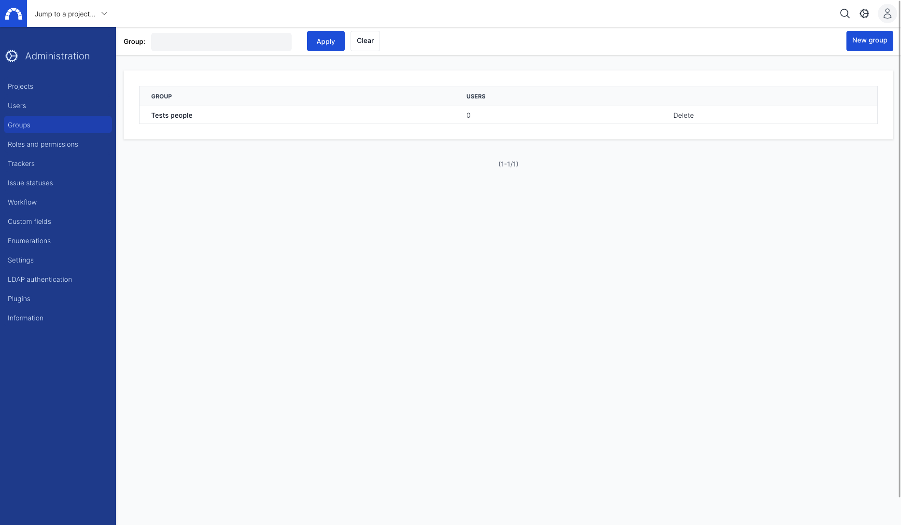
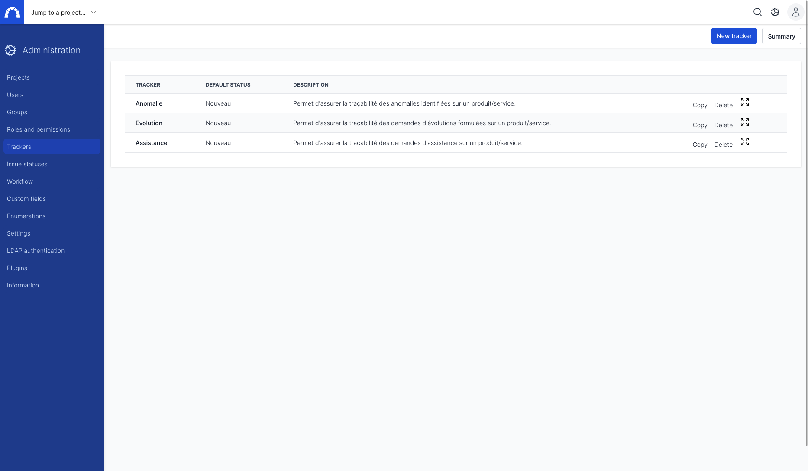
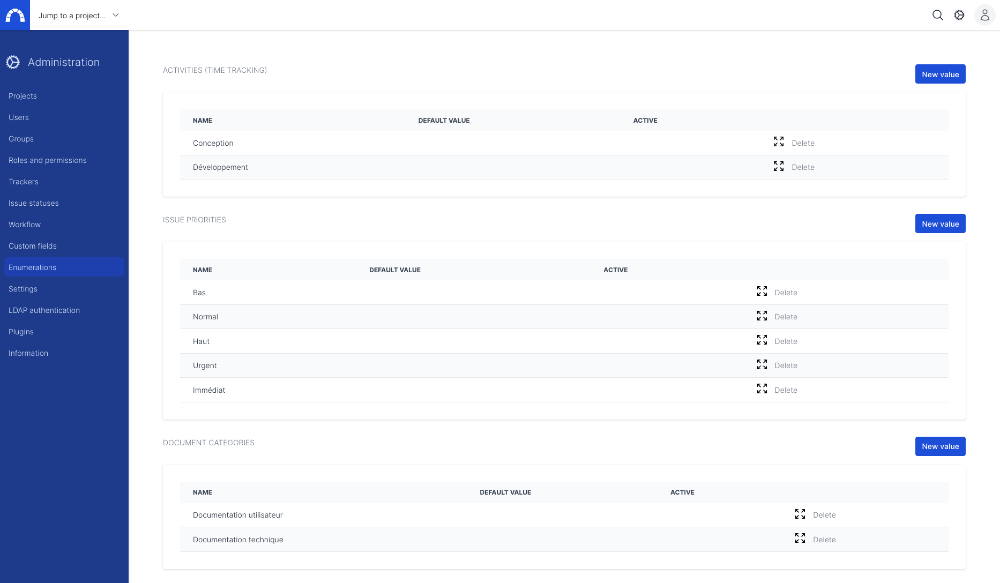

# Progress & demos

## First step : layout & navbar

The work start with the global layout (file `base.html.erb`) and the navbar.
On the left side, the projects navigation part with a breadcrumb to quickly go to the parent's projects of the current one.

On the right, the search field and a dropdown menu for the user menu.

Add project menu in the navbar

Finally add issue menu

And start issues list

## Issue

Tried something with issue (3 columns but only the one in the middle for now)

The idea : add a navigation on the left to go from one issue to another one.
In the middle, focus on the issue, all attributes are moved to the right panel.

Need to be improved and test

Issue with attachment and navigation on the left

Let see it in action

## Calendar

And when the user click on the filter icon on the right

## Gantt

First version but need extra work

## About

About in a modal

## User settings (ex : my account)

## Admin

Administration is available from the navbar. A dropdown menu allow admin user to jump directly to the differents pages.

## Add turbo

Include turbo 8 which has a uge effect on performances. Drawbacks are that adjustments have to be done on specific js. For example, some work on the navbar have to be done.

## User profile page

## Login page

Todo : as an admin user, i'd like to choose the background image (or none) in the settings of the plugin

